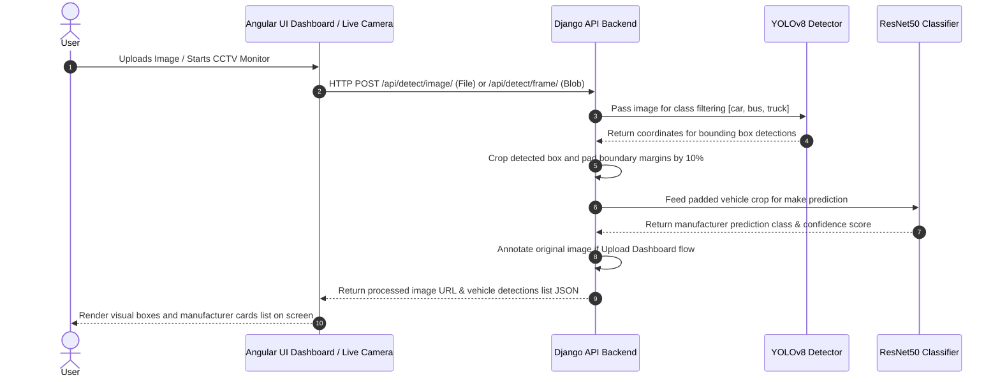

# DevLab-One Car Detection Full Architecture Flow

This document details the complete architectural wireframe flow for the Car Detection & Manufacturer Classification project. The corresponding high-fidelity visual layout has been generated as a vector graphic sheet which can be imported directly into Figma.

---

## 🎨 Figma Vector Design File

A fully editable vector architecture diagram has been generated at:
*   **Vector Layout File**: [architecture_flow.svg](file:///Users/aravindhansenthilkumar/Documents/DevLab-One/docs/architecture_flow.svg)

> [!TIP]
> **Figma Integration**: To open this in Figma, simply drag and drop the `architecture_flow.svg` file directly onto your Figma workspace canvas. Figma will automatically convert the SVG paths, text nodes, colors, and gradients into fully editable, layered vector frames and shapes.

---

## 🛠️ System Components & Interaction Flow

---

## 📋 Component Descriptions

### 1. Frontend Client (Angular SPA)
*   **Upload Dashboard View**: Allows manual drops of `.png`, `.jpg`, and `.webp` vehicle images. Displays the returned processed image containing bounding boxes, alongside details in the sidebar showing prediction percentages.
*   **Live CCTV Monitor View**: Polls frames from the local webcam stream, sending them to the backend at ~2 FPS (throttled to avoid network overflow). Renders an canvas overlay dynamically on top of the running video to map coordinates. Maintains a retro-style terminal window listing rolling detections in real-time.
*   **HTTP Client Service**: Interfaces with REST endpoints and fetches fallback configurations using `/api/model/info/`.

### 2. Backend Server (Django REST Framework)
*   `views.py` processes raw uploads and coordinates YOLO frame cropping.
*   Pads cropped bounding boxes by 10% before classifier inference to ensure badges/manufacturer emblems (grilles, logos) are fully contained within the sub-image.
*   Checks if classification probability exceeds a `0.75` threshold. If lower, returns `"Unknown Manufacturer"` to prevent high-bias false predictions.

### 3. ML Architecture (PyTorch / Ultralytics)
*   **YOLOv8**: Pre-trained localization model used strictly as a fast region proposer.
*   **ResNet50 Classifier**: Fine-tuned on the custom target vehicle set: Audi, BMW, Jeep, Suzuki, and Tesla. Saves weights checkpoints (`resnet50_epoch_X.pt`) to drive the backend classifier forward pass.
